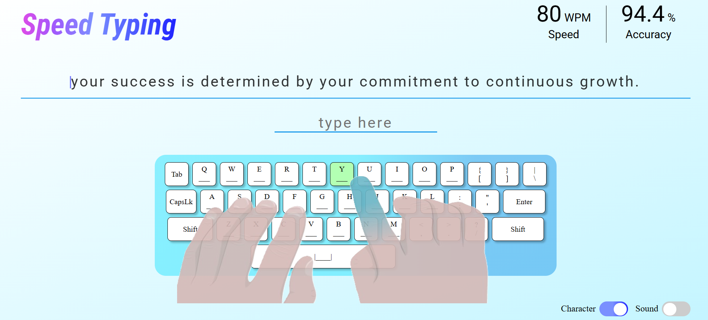

# Speed Typing

[Visit Site](https://harshitrajsinha.github.io/speed-typing/)

An engaging and fun typing game designed to help users improve their typing speed and accuracy. This game features a collection of unique quotes fetched from an API, creating a dynamic experience with every session. It also includes options to toggle special character challenges and background music for a personalized experience.



## Features

- **Dynamic Quotes**: Quotes are fetched in real-time from a GitHub Gist API, ensuring fresh and diverse content with each session.
- **Typing Accuracy & Speed**: Track your performance with words-per-minute (WPM) and accuracy stats displayed at the end of each session.
- **Customizable Experience**:
  - **Character Toggle**: Enable or disable special characters (such as punctuation marks) in the sentence. This feature is enabled by default.
  - **Sound Toggle**: Play or pause background music to enhance the gaming experience. This feature is disabled by default.
- **Responsive Design**: The game is optimized for desktop and mobile devices, offering an enjoyable experience on any screen size.
- **REST API**: Quotes are fetched using a RESTful API, sourced from a GitHub Gist collection.
- **Conditional Fetching**: The application gracefully handles request timeouts by falling back to a default sentence if the API request fails.

## Installation

To run this project locally, follow these steps:

1. **Clone the repository**:

   ```bash
   git clone https://github.com/yourusername/interactive-typing-game.git
   ```

2. **Navigate into the project folder**:
   ```bash
   cd speed-typing
   ```
3. **Initialize npm and run**:
   ```bash
   npm init && npm run dev
   ```

## Tech Stack

- **HTML**: For the structure of the game interface.
- **CSS**: For styling the game elements and ensuring responsiveness.
- **JavaScript**: To handle dynamic quote fetching, typing challenge logic, and user interactions.
- GitHub Gist API: To provide a collection of quotes dynamically.
